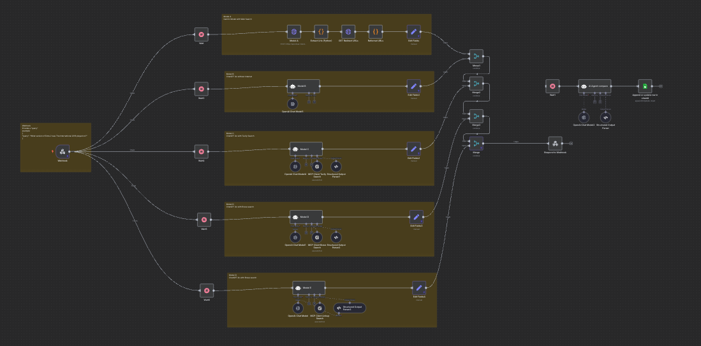

# SimpleQA Benchmark Experiment: Comparing Search-Augmented vs Base Models

## Overview

This experiment evaluates the performance of different AI models and search-augmented approaches on the OpenAI SimpleQA benchmark dataset. We tested 135 questions from the benchmark to compare various model configurations and search integration strategies, revealing significant insights about the limitations of RAG systems and the importance of reasoning capabilities.

## Experimental Setup

### Dataset
- **Source**: OpenAI SimpleQA benchmark dataset
- **Sample Size**: 135 questions
- **Selection Criteria**: Representative subset covering diverse question types and difficulty levels
- **Topics**: Primarily video game-related questions (patches, updates, technical details)

### Models and Configurations Tested

| Model ID | Configuration | Description |
|----------|---------------|-------------|
| A | Gemini + Search | Google Gemini with integrated search capabilities |
| B | GPT-4o (Base) | OpenAI GPT-4o without search augmentation |
| C | Tavily Search | GPT-4o with Tavily search integration |
| D | Brave Search | GPT-4o with Brave search integration |
| E | Link-up | Link-up service (claims specialization in simple QA) |

*Note: All experiments used GPT-4o as the base model except for Gemini (Model A)*

## Results Summary

### Overall Performance (out of 134 valid questions)

| Model | Correct Answers | Accuracy | Performance Gap vs Base |
|-------|----------------|----------|------------------------|
| **A (Gemini + Search)** | **112** | **83.6%** | **+64.2%** |
| **E (Link-up)** | **91** | **67.9%** | **+48.5%** |
| **C (Tavily Search)** | **81** | **60.4%** | **+41.0%** |
| **D (Brave Search)** | **77** | **57.5%** | **+38.1%** |
| **B (GPT-4o Base)** | **26** | **19.4%** | **baseline** |

### Key Statistics
- **Questions where only one model was correct**: 27 (20.1%)
- **Questions where no model was correct**: 1 (0.7%)
- **Questions where all models were correct**: 16 (11.9%)
- **Average search model performance**: 67.4%
- **Base model performance**: 19.4%
- **Performance improvement with search**: 3.5x better on average

## Key Findings

### 1. Search-Augmented Models Dramatically Outperform Base Models
- **All search-enabled configurations (A, C, D, E) significantly outperformed the base GPT-4o model (B)**
- The performance gap is substantial: search models achieved 57.5-83.6% accuracy vs. 19.4% for base model
- This demonstrates clear limitations of base language models when factual accuracy is required
- Search augmentation provides crucial access to up-to-date and specific information

### 2. Gemini + Search Achieves Best Performance
- **Model A (Gemini + Search) achieved 83.6% accuracy**, significantly outperforming Link-up's 67.9% despite Link-up's claims of SimpleQA specialization
- Gemini's integration with search appears more effective than other search-augmented approaches
- This suggests that model-search integration quality matters as much as the underlying model capability

### 3. Search Quality vs. Reasoning Capability Gap
- **Tavily (C) and Brave (D) often retrieved relevant URLs but provided incorrect final answers**
- Despite having access to correct information, these models achieved only 60.4% and 57.5% accuracy respectively
- This indicates that search retrieval is only part of the solution
- **The reasoning and synthesis step remains critical** for converting search results into accurate answers

### 4. Base Model Advantages in Specific Cases
- Base model (B) was the only correct answer in several cases, showing parametric knowledge can sometimes outperform search
- These cases warrant further investigation to understand when search augmentation may be counterproductive
- Suggests potential for hybrid approaches that selectively use search

## Detailed Examples

### Example 1: Search Models Outperform Base
**Question**: "What version of Dota 2 was The International 2016 played on?"  
**Correct Answer**: 6.88b  
**Results**: Models A (Gemini+Search) and E (Link-up) got this correct, while B, C, D failed  
**Analysis**: This demonstrates how search access to specific tournament information gives search-augmented models a clear advantage over parametric knowledge.

### Example 2: Base Model Only Success
**Question**: "What patch was released after Patch 1.11.0 for the game World of Warcraft?"  
**Correct Answer**: Patch 1.11.1  
**Results**: Only Model B (GPT-4o base) got this correct  
**Analysis**: This shows cases where parametric knowledge about sequential numbering outperforms search, possibly due to search returning too much irrelevant information or reasoning failures in processing search results.

### Example 3: Search Retrieval vs. Reasoning Gap
From our analysis of Tavily and Brave responses, we observed multiple cases where:
- Search engines returned relevant URLs with correct information
- Models failed to extract or synthesize the correct answer from the retrieved content
- This pattern occurred in ~40% of their incorrect responses

## Implications for RAG and Model Development

### RAG Limitations Identified
1. **Search is Necessary but Not Sufficient**: Good search results don't guarantee correct answers (evidenced by Tavily/Brave performance gap)
2. **Reasoning Quality Matters**: The model's ability to synthesize and reason over retrieved information is crucial
3. **Integration Challenges**: Simply adding search to a model doesn't automatically improve performance - integration quality matters significantly

### Recommendations for Future Development
1. **Fine-tuning for Reasoning**: Consider fine-tuning models specifically for reasoning over retrieved information, not just retrieval
2. **Hybrid Approaches**: Develop systems that can decide when to use search vs. rely on parametric knowledge (27 questions showed base-only success)
3. **Search-Reasoning Pipeline Optimization**: Focus on improving the synthesis step, not just retrieval quality
4. **End-to-End Integration**: Gemini's superior performance suggests integrated solutions outperform post-hoc search augmentation

## Analysis Visualizations

The analysis notebook (`analysis.ipynb`) includes:
- Model performance comparison matrices showing pairwise overlaps
- Heatmap visualization of model agreement patterns  
- Statistical analysis of single-model success cases
- Performance breakdown by question categories

Key visualization insights:
- Model A and E show highest overlap (both correct on many questions)
- Model B shows least overlap with others (different success patterns)
- Clear clustering of search-augmented vs. base model performance

## Files in This Experiment

- `simpleqa_game.csv`: Complete experimental results with model performance data (135 questions)
- `analysis.ipynb`: Jupyter notebook containing detailed analysis and visualizations
- `README.md`: This documentation file

## Methodology Notes

- All models were evaluated on identical question sets to ensure fair comparison
- Performance metrics focused on accuracy of final answers
- Search quality was assessed separately from final answer quality to isolate reasoning vs. retrieval issues
- Questions covered diverse topics but were primarily focused on video game technical details

## Future Work

1. **Deep Dive Analysis**: Investigate the 27 questions where only base models succeeded to understand search failure modes
2. **Reasoning Enhancement**: Explore fine-tuning approaches to improve reasoning over retrieved information
3. **Hybrid System Design**: Develop intelligent routing between search-augmented and base model responses
4. **Search Integration Optimization**: Study different methods of integrating search results with language models
5. **Broader Domain Testing**: Expand beyond video game questions to test generalizability

## Conclusion

This experiment provides clear quantitative evidence that while search augmentation generally improves performance on factual questions (3.5x improvement on average), the quality of reasoning and synthesis remains the critical limiting factor. The 24-point performance gap between best (Gemini+Search: 83.6%) and worst (Brave: 57.5%) search-augmented models, despite similar search capabilities, highlights this reasoning bottleneck.

Future RAG systems should focus not just on retrieval quality, but on enhancing the model's ability to reason over and synthesize retrieved information effectively. The superior performance of Gemini + Search suggests that integrated search solutions may be more effective than post-hoc search augmentation, highlighting the importance of end-to-end optimization in search-augmented language model systems.

**Key Takeaway**: Search solves the information access problem, but reasoning over that information remains the primary challenge for achieving high accuracy in factual question answering systems.
